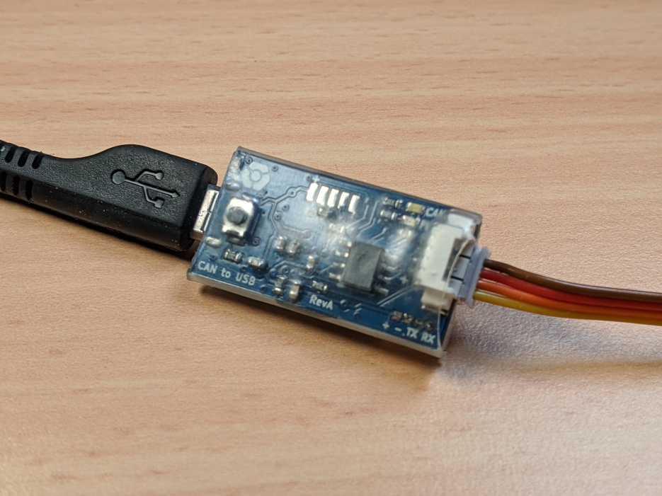

# CAN USB adapter

The CAN USB adapter allows us to inspect the CAN bus of our robots from our laptops, very convenient.
It acts as a read / write translator over the CAN bus, relaying all the traffic over USB, through serial line CAN (SLCAN).

UAVCAN supports SLCAN interfaces, and provides a [Python library](https://github.com/UAVCAN/pyuavcan).
This means we can easily interact with the boards on the bus through Python scripts.
In fact, this is how we build most of our introspection tools.

We also use this adapter to flash our boards over CAN using our [bootloader](https://github.com/cvra/can-bootloader).

Summary of features:

- CAN interface with communication over UAVCAN.
- Molex Picoblade connectors for wiring CAN in daisy chain.
- Micro USB connector that exposes a serial interface and a CAN interface (over SLCAN). It can also be used for flashing the adapter using DFU.
- Costs < 20 USD in components.

## Links
- [Hardware](https://github.com/cvra/CAN-USB-dongle) including KiCad files, the schematics in PDF, and gerber files.
- [Software](https://github.com/cvra/CAN-USB-dongle-fw) using ChibiOS RTOS/HAL, and UAVCAN for communication.
