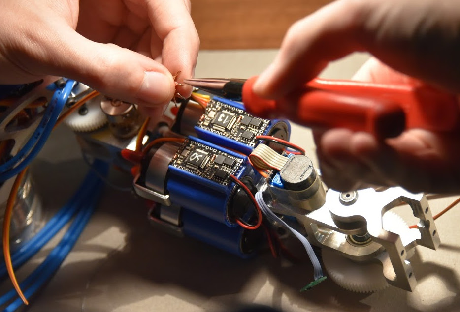

# Motor board

The Motor board is a small board (31x16mm) with a dedicated STM32F3 microcontroller that is at the core of all our robots since 2015.
We have been using it to control DC motors, motor pumps, and RC servos.
Here are its main features:

 - CAN interface with communication over UAVCAN for parameter/gain setting, setpoint sending, and feedback streaming.
 - CAN bootloader for easy firmware update over the bus.
 - Control a single DC motor with current sensing, allowing cascaded PID control (torque, velocity, and position).
 - H-bridge to drive the motor bidirectionally that supports driving a motor with up to 16.8V @ 6.6A continuously.
 - Quadrature encoder interface for motor (5V tolerant).
 - Secondary quadrature encoder interface (5V tolerant) (eg. for separate odometry wheels).
 - Analog input for RC-servo control.
 - Digital input for indexing, allows us to determine a reference location on a given axis that can be used for absolute positioning.
 - Runs on 3 or 4 cell LiPo/LiFe batteries.
 - SWD connector for flashing and debugging, with UART exposed on the same connector.
 - Costs < 35 USD in components.

## Links
- [Hardware](https://github.com/cvra/motor-control-board) including KiCad files, the schematics in PDF, and gerber files.
- [Software](https://github.com/cvra/robot-software/tree/master/motor-control-firmware) using ChibiOS RTOS/HAL, and UAVCAN for communication.
- [Bootloader](https://github.com/cvra/can-bootloader) based on libOpenCM3 and a custom lightweight protocol.
