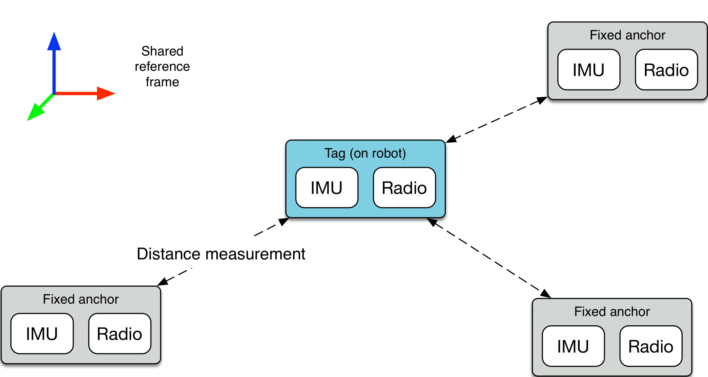

# Positioning system

Using our [beacon board](./beacon.md), we can build a positionning system.
To do so, we will need a few fixed anchors whose positions are known.
Then, we can use a moving tag that measures its distance to the anchors.
Finally, a Kalman filter fuses those measurements into an absolute position.
This principle is similar to the operation of GPS receivers.

We tested this system both indoor and outdoor, on small (3mx2m) and larger (20mx20m) maps.
It provides the position within 5 cm accuracy, at up to 50 Hz when using a single tag.
We noticed that having 4 fixed anchors conditions the positioning better when using a non-coplanar constellation.

This system is not too expensive compared to similar solutions.
To get a 3D position we need 4 anchors and one tag per robot.
Each board is 50$, for a total cost of 250$.

For more information see the [technical report](https://github.com/cvra/robot-software/tree/master/uwb-beacon-firmware/doc/report.pdf).
